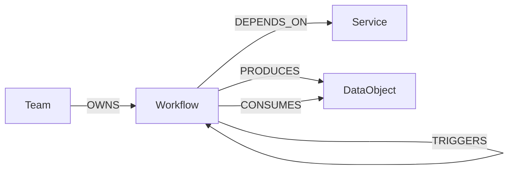
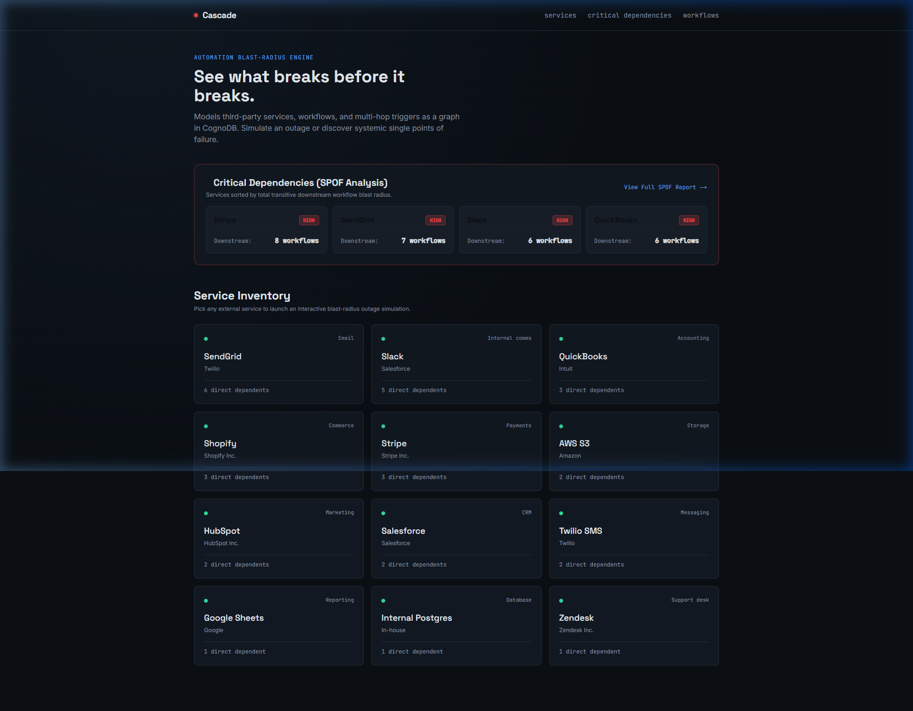
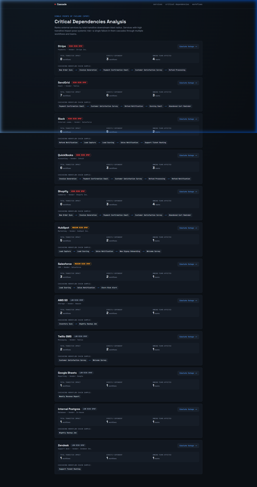
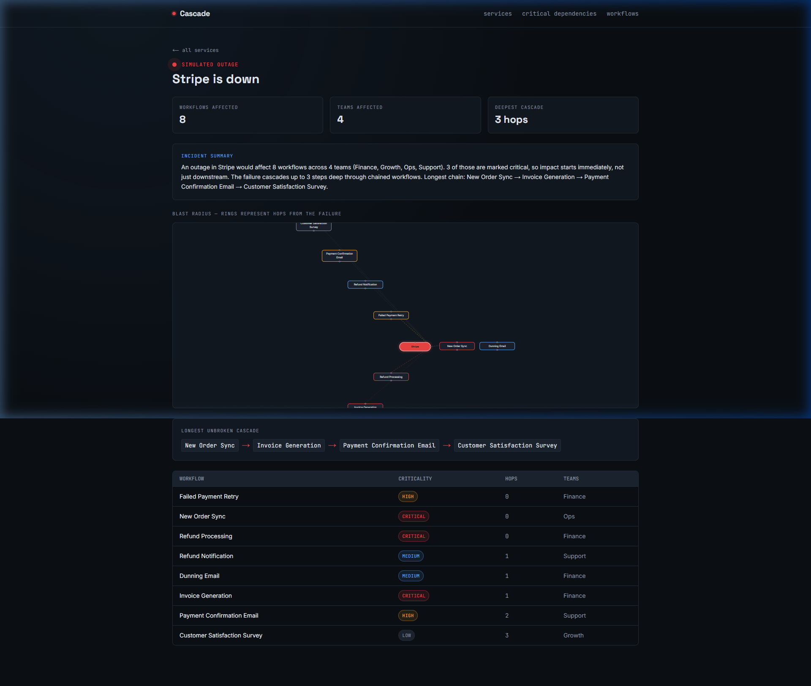
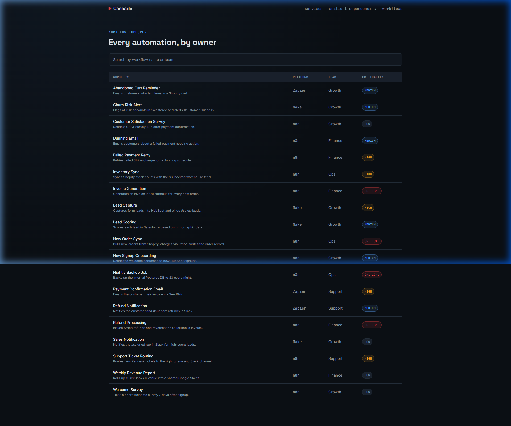

# Cascade — automation blast-radius mapping

**See what breaks before it breaks.**

Cascade models a company's automation stack — n8n/Zapier/Make workflows, the third-party
services they call (Stripe, Shopify, SendGrid...), and the chains where one workflow's
completion triggers the next — as a graph in **CognoDB**. Pick a service, simulate an
outage, and instantly see every workflow that fails as a direct or *cascading* result,
which teams own them, and the single longest unbroken failure chain the outage sets off.

Built for Wexa AI's take-home assignment.

---

## Why a graph database?

The core question this app answers — *"if Stripe goes down, what breaks, and how far
does the damage spread?"* — is fundamentally a **path-finding problem**, not a
row-lookup problem:

- **Failures cascade transitively.** Workflow A triggers B triggers C triggers D.
  Finding every workflow eventually affected by one outage means walking a chain of
  unknown, variable depth. In Cypher that's `(origin)-[:TRIGGERS*0..6]->(downstream)` —
  one line. In SQL it's a recursive CTE, re-joined at every depth, with manual
  cycle-guards to stop infinite loops if the automation graph ever has a feedback path.
- **"How far does it spread" is a shortest/longest-path question.** The longest
  unbroken cascade chain from an outage (`app/queries.py::longest_cascade_chain`) is a
  native graph traversal. The relational equivalent requires materializing every
  possible path length and comparing — expensive and awkward at any real depth.
- **The relationships *are* the interesting data.** A relational schema would store
  `workflow_id, depends_on_service_id` rows just fine for *one hop*. But the product's
  actual value — multi-hop blast radius, team-level impact, cascade depth — only exists
  by traversing relationships, which is exactly what a graph database is built to do
  cheaply regardless of how deep the chain runs.

A few thousand nodes and relationships is enough to demonstrate this clearly, which is
why CognoDB's free tier is a comfortable fit.

---

## Data model



| Node | Key properties |
|---|---|
| `Service` | `id, name, category, vendor, status` — an external dependency (Stripe, Shopify, Slack...) |
| `Workflow` | `id, name, platform, status, criticality, description` — one automation |
| `Team` | `id, name` — the owning team |
| `DataObject` | `id, name` — the business object a workflow reads/writes (Order, Invoice...) |

| Relationship | Meaning |
|---|---|
| `(Team)-[:OWNS]->(Workflow)` | who's on call when it breaks |
| `(Workflow)-[:DEPENDS_ON]->(Service)` | a hard external dependency |
| `(Workflow)-[:TRIGGERS]->(Workflow)` | completion of one workflow kicks off the next |
| `(Workflow)-[:PRODUCES\|CONSUMES]->(DataObject)` | the data contract between workflows |

The seed dataset (`backend/seed/seed_data.py`) models a realistic small-company stack:
4 teams, 12 services, 4 data objects, and 18 workflows — including genuine multi-step
cascade chains (e.g. a Stripe outage cascades through order sync → invoicing → payment
confirmation email → CSAT survey, a 4-hop chain spanning 3 teams).

---

## The key graph queries this app is built around

**1. Single Point of Failure (SPOF) Analysis** (`app/queries.py::get_critical_dependencies`) — calculates total transitive downstream impact for every external service to identify systemic risk:

```cypher
MATCH (s:Service)
OPTIONAL MATCH (origin:Workflow)-[:DEPENDS_ON]->(s)
OPTIONAL MATCH path = (origin)-[:TRIGGERS*0..6]->(downstream:Workflow)
WITH s,
     count(DISTINCT origin) AS directWorkflows,
     count(DISTINCT downstream) AS totalImpactedWorkflows,
     collect(DISTINCT downstream.criticality) AS criticalities,
     collect(DISTINCT downstream.name)[..5] AS sampleWorkflows
OPTIONAL MATCH (origin:Workflow)-[:DEPENDS_ON]->(s)
OPTIONAL MATCH p = (origin)-[:TRIGGERS*0..6]->(downstream:Workflow)
OPTIONAL MATCH (t:Team)-[:OWNS]->(downstream)
RETURN s.id, s.name, s.category, s.vendor,
       directWorkflows, totalImpactedWorkflows,
       count(DISTINCT t) AS impactedTeamCount,
       ("critical" IN criticalities) AS hasCriticalWorkflows,
       sampleWorkflows
ORDER BY totalImpactedWorkflows DESC, directWorkflows DESC
```

**2. Multi-hop blast radius** (`app/queries.py::blast_radius`) — every workflow
transitively affected by an outage, tagged with hop-distance and owning teams:

```cypher
MATCH (s:Service {id: $serviceId})
MATCH (origin:Workflow)-[:DEPENDS_ON]->(s)
MATCH path = (origin)-[:TRIGGERS*0..6]->(downstream:Workflow)
WITH s, downstream, min(length(path)) AS hopsFromFailure
MATCH (team:Team)-[:OWNS]->(downstream)
RETURN s.name AS serviceName,
       downstream.id AS workflowId,
       downstream.name AS workflowName,
       downstream.criticality AS criticality,
       hopsFromFailure,
       collect(DISTINCT team.name) AS teams
ORDER BY hopsFromFailure ASC
```

**3. Longest cascade chain** (`app/queries.py::longest_cascade_chain`) — the relational-unfriendly
one: the single longest unbroken sequence of triggered workflows set off by an outage.

```cypher
MATCH (s:Service {id: $serviceId})
MATCH (origin:Workflow)-[:DEPENDS_ON]->(s)
MATCH path = (origin)-[:TRIGGERS*0..6]->(terminal:Workflow)
WHERE NOT (terminal)-[:TRIGGERS]->()
WITH path, length(path) AS chainLength
ORDER BY chainLength DESC LIMIT 1
RETURN [n IN nodes(path) | n.name] AS chain, chainLength
```

All queries are called with parameters via the official Neo4j driver — no string-concatenated
Cypher anywhere in the app (`backend/app/db.py::run_query`).

An optional AI layer (`backend/app/ai_summary.py`) turns query #2's output into a
2–3 sentence plain-English incident summary via the Gemini API, with a
template-based fallback so the core product works with zero AI dependency.

---

## Project structure

```
cascade/
├── backend/                 FastAPI + official neo4j Python driver
│   ├── app/
│   │   ├── config.py        env-var settings (never hardcoded secrets)
│   │   ├── db.py             driver singleton, connection-error handling
│   │   ├── queries.py        Cypher queries (SPOF, Blast Radius, Longest Chain)
│   │   ├── ai_summary.py     LLM incident summary + safe fallback
│   │   ├── schemas.py        response models (Service, CriticalDependency, BlastRadius)
│   │   ├── routers/          graph.py (service, SPOF, workflow endpoints), health.py
│   │   └── main.py           FastAPI app, CORS
│   ├── seed/seed_data.py     loads the demo dataset
│   └── .env.example
└── frontend/                 Next.js 14 (App Router) + TypeScript + Tailwind
    ├── app/
    │   ├── page.tsx                     service dashboard + SPOF highlight widget
    │   ├── dependencies/page.tsx        SPOF ranking & critical dependency report
    │   ├── workflows/page.tsx           browse/search all workflows
    │   └── blast-radius/[serviceId]/    outage simulation + graph + AI summary
    ├── components/
    │   ├── BlastRadiusGraph.tsx         reactflow radial "hop ring" visualization
    │   ├── Nav.tsx / Primitives.tsx     nav, loading/empty/error states
    └── lib/api.ts                       typed API client
```

---

## Setup

### 1. Create your CognoDB instance
1. Sign up at [console.cognodb.com/signup](https://console.cognodb.com/signup) (no credit card).
2. Create a free `c0` instance, pick a region — provisions in under a minute.
3. **Copy the generated password immediately** — it's shown once. You'll get a URI like
   `bolt+s://<instance-id>.databases.cognodb.cloud`.

### 2. Backend
```bash
cd backend
python -m venv .venv && source .venv/bin/activate   # or your usual venv workflow
pip install -r requirements.txt
cp .env.example .env        # fill in NEO4J_URI / NEO4J_USER / NEO4J_PASSWORD
python seed/seed_data.py    # loads the demo automation stack
uvicorn app.main:app --reload --port 8000
```
Visit `http://localhost:8000/health` — should return `{"database_connected": true}`.

### 3. Frontend
```bash
cd frontend
npm install
cp .env.local.example .env.local   # NEXT_PUBLIC_API_URL=http://localhost:8000
npm run dev
```
Visit `http://localhost:3000`.

### Optional: AI incident summaries
Set `GEMINI_API_KEY` in `backend/.env`. Without it, summaries fall back to a
template that still reports scale, teams, and cascade depth — the app is fully
functional either way.

---

## Error handling

If CognoDB is unreachable or misconfigured, the API returns a clean `503` with a
human-readable message (`app/db.py::DatabaseUnavailable`) instead of a stack trace, and
the frontend surfaces it as a dedicated connection-error state rather than a blank
screen or infinite spinner.

---

## Deployment

- **Frontend**: [Vercel](https://vercel.com) — import the repo, set the `frontend`
  directory as root, add `NEXT_PUBLIC_API_URL` pointing at your deployed backend.
- **Backend**: [Render](https://render.com) or [Railway](https://railway.app) —
  deploy `backend/`, set `NEO4J_URI`, `NEO4J_USER`, `NEO4J_PASSWORD`,
  `GEMINI_API_KEY` (optional), and `CORS_ORIGINS` to your Vercel domain.

## Screenshots

### Service dashboard with SPOF highlight widget — pick any service to simulate an outage


### Single Point of Failure (SPOF) Analysis & Ranking — critical dependency report


### Blast-radius simulation — Stripe outage (8 workflows, 4 teams, 3-hop cascade)


### Workflow explorer — browse and search every automation


## Demo

_Hosted demo link and screen recording will be added here before final submission._

